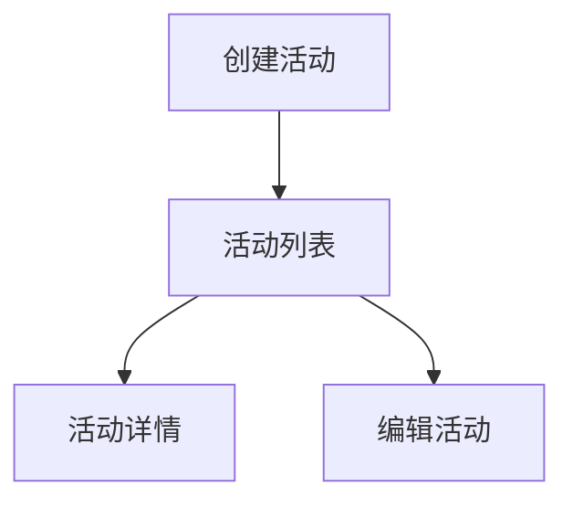
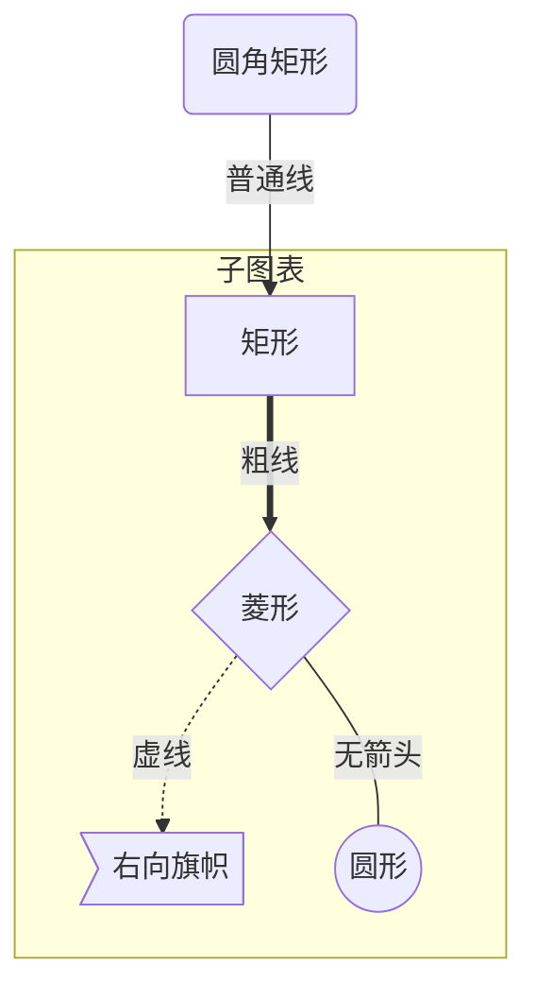
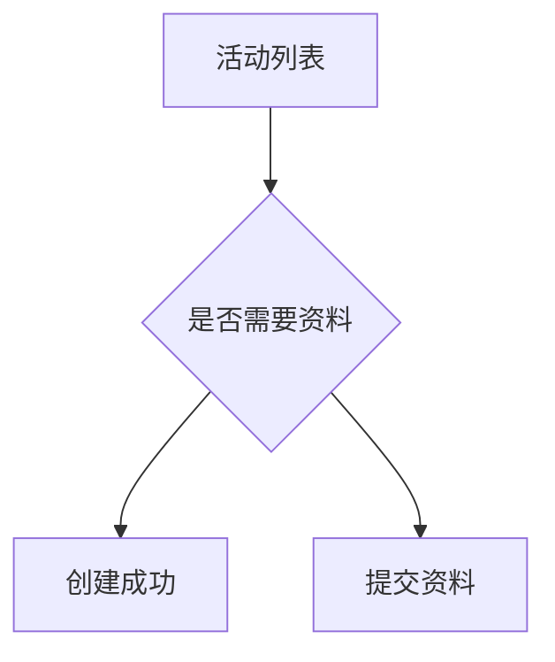

管理员

```mermaid
graph TD;
创建活动-->活动列表
活动列表-->活动详情
活动列表-->编辑活动

```

```mermaid
graph TB
    id1(圆角矩形)--普通线-->id2[矩形]
    subgraph 子图表
        id2==粗线==>id3{菱形}
        id3-.虚线.->id4>右向旗帜]
        id3--无箭头---id5((圆形))
    end
```

```mermaid
graph TB
活动列表-->id3{是否需要资料}
id3-->创建成功
id3-->提交资料
```
